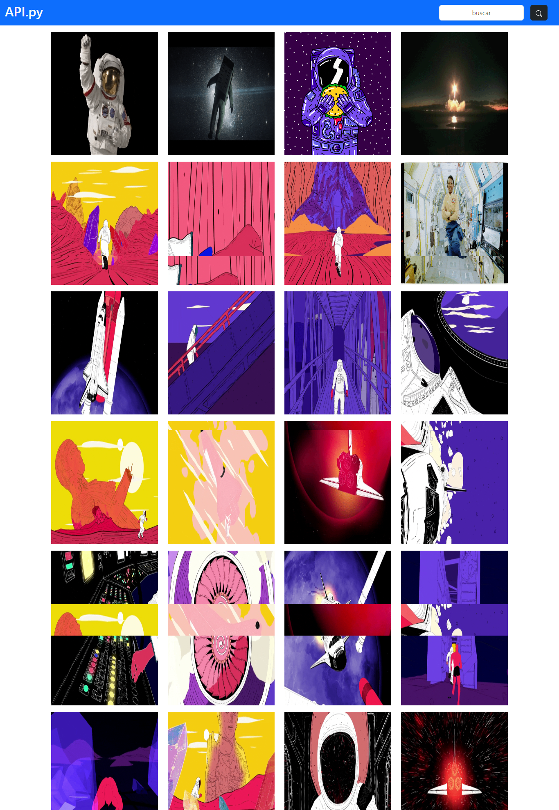

#   Consumo de API GIPHY con Flask + Bootstrap

    

##  [API GIPHY](https://developers.giphy.com/docs/api/endpoint#search)

##  Requerimientos:
### Instalar Flask: `pip install Flask`
Si ya lo tiene y quieres actualizarlo
### Actualizar Flask: `pip install -U Flask`

#   [Versión con JavaScript](https://github.com/mssj-11/API-GIPHY_Js)